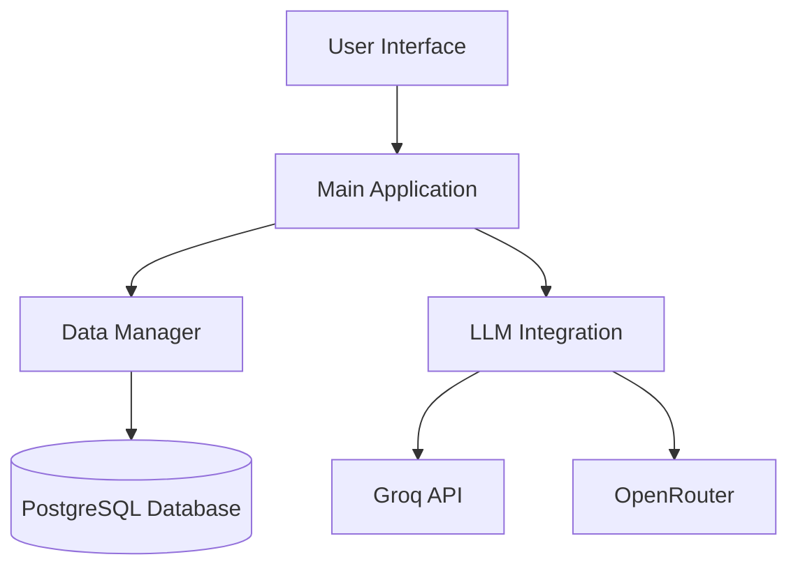

# Academic AI Assistant - Comprehensive Architecture Documentation

## System Overview
The Academic AI Assistant is a Python-based application designed to support students and researchers through AI-powered academic assistance. The system combines natural language processing with academic content management to provide intelligent study aids, research tools, and learning recommendations.

**Key Features:**
- Note generation and summarization
- Study planning and scheduling
- Research assistance
- Quiz generation and knowledge testing

## Core Components

### 1. Main Application (academic_ai_assistant.py)
**Responsibilities:**
- Serves as the central coordinator for all system operations
- Implements the Streamlit-based user interface
- Manages user sessions and state
- Routes requests to appropriate components

**Key Modules:**
- User interface handlers
- Navigation controller
- Session management
- Error handling

### 2. Data Management Layer (data_manager.py)
**Data Domains:**
- User profiles and preferences
- Academic notes and materials
- Study schedules and tasks
- Knowledge base content

**Technical Implementation:**
- PostgreSQL database integration
- Data validation and sanitization
- CRUD operations
- Complex query handling

### 3. AI Integration Layer (LLM.py)
**Supported AI Providers:**
- Groq API (primary)
- OpenRouter (fallback)

**Key Capabilities:**
- Multiple model support (LLaMA 3, others)
- Synchronous and asynchronous interfaces
- Response formatting and processing
- Error handling and fallback mechanisms

## System Architecture

## Data Flow

1. **User Request Processing:**
   - UI captures user input
   - Main app validates and routes request
   - Relevant data retrieved from database
   - Request formatted for AI processing

2. **AI Interaction:**
   - Query sent to configured AI provider
   - Response received and parsed
   - Results formatted for user presentation

3. **Response Handling:**
   - Results stored in database
   - User interface updated
   - Analytics recorded

## Key Architectural Decisions

1. **Modular Design**
   - Components developed as independent modules
   - Clear interfaces between components
   - Easy replacement of individual components

2. **AI Provider Abstraction**
   - Standardized interface for AI providers
   - Configuration-based provider selection
   - Fallback mechanisms for reliability

3. **Data Security**
   - Encryption for sensitive data
   - Input validation and sanitization
   - Role-based access control

4. **Performance Considerations**
   - Asynchronous operations
   - Caching strategies
   - Load management

## Technical Specifications

**Requirements:**
- Python 3.10+
- PostgreSQL 14+
- Streamlit 1.30+
- LangChain 0.1+

**Dependencies:**
- psycopg2 (database)
- langchain-groq (AI integration)
- python-dotenv (configuration)