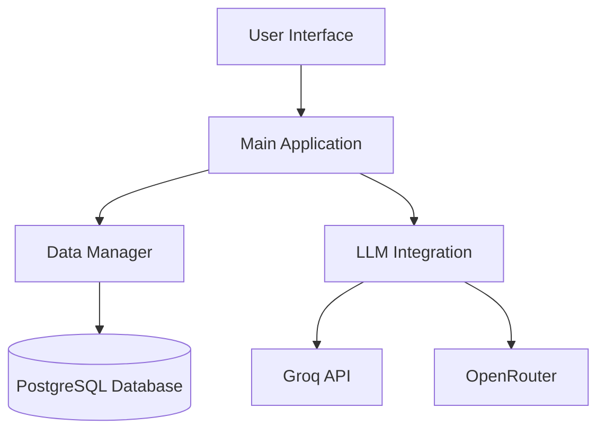

# Implementation Chapter

## System Overview
The Academic AI Assistant is a Python-based application designed to support students and researchers through AI-powered academic assistance. The system combines natural language processing with academic content management to provide intelligent study aids, research tools, and learning recommendations.

**Key Features:**
- Note generation and summarization
- Study planning and scheduling
- Research assistance
- Quiz generation and knowledge testing

## Component Architecture

### 1. Main Application (academic_ai_assistant.py)
**Responsibilities:**
- Serves as central coordinator for all system operations
- Implements Streamlit-based user interface
- Manages user sessions and state
- Routes requests to appropriate components

**Key Modules:**
- User interface handler
- Navigation controller
- Session management
- Error handling

### 2. Data Management Layer (data_manager.py)
**Data Domains:**
- User profiles and preferences
- Academic notes and materials
- Study schedules and tasks
- Knowledge base content

**Technical Implementation:**
- PostgreSQL database integration
- Data validation and sanitization
- CRUD operations
- Complex query handling

### 3. AI Integration Layer (LLM.py)
**Supported AI Providers:**
- Groq API (primary)
- OpenRouter (fallback)

**Key Capabilities:**
- Multiple model support (LLaMA 3, others)
- Synchronous and asynchronous interfaces
- Response formatting and processing
- Error handling and fallback mechanisms

## Data Flow Diagram

## Configuration Requirements
- Python 3.10+
- PostgreSQL 14+
- Streamlit 1.30+
- LangChain 0.1+
- psycopg2 (database)
- langchain-groq (AI integration)
- python-dotenv (configuration)

## Error Handling Approaches
- Input validation and sanitization
- Fallback mechanisms for AI providers
- Exception handling for database operations
- Logging for debugging

## Dependencies and Interfaces
- Database: PostgreSQL with psycopg2
- AI Providers: Groq API and OpenRouter
- Web Framework: Streamlit
- Configuration: python-dotenv